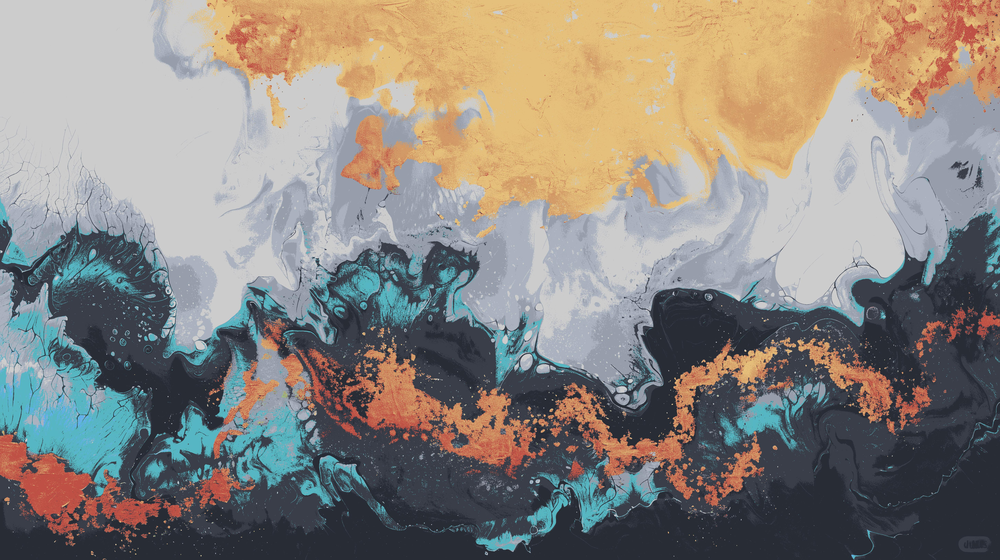

# GoWallClone

*Clone of the awesome tool gowall, https://github.com/Achno/gowall, to convert wallpaper colors to match a color scheme.*

## Installation

```
$ go build -ldflags "-w" main.go
$ strip main
$ sudo mv main /usr/bin/gowall
```

## Usage

```
$ gowall <generate|convert> <config file path> <image path> [save path]
```

To create a new color scheme from an image:

```
$ gowall generate <config file path> <image path>
```

To create a new wallpaper based on a color scheme:

```
$ gowall convert <config file path> <image path> <save path>
```

A config file should have a list of colors for your color scheme in JSON format:

```JSON
{
    "Colors": [
        "#979eab",
        "#282c34",
        "#cccccc",
        "#282c34",
        "#e06c75",
        "#98c379",
        "#e5c07b",
        "#61afef",
        "#be5046",
        "#56b6c2",
        "#979eab",
        "#393e48",
        "#d19a66",
        "#56b6c2",
        "#e5c07b",
        "#61afef",
        "#be5046",
        "#56b6c2",
        "#abb2bf",
        "#282c34",
        "#979eab"
    ]
}
```

## Example

**Before:**


**After:**

